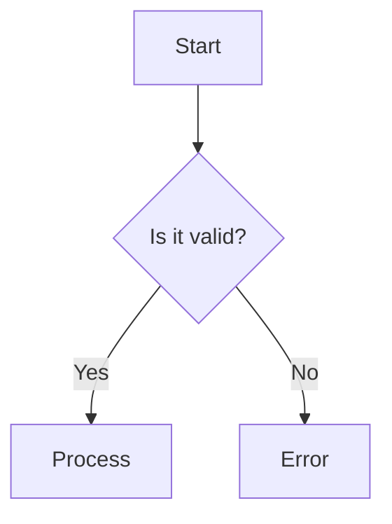
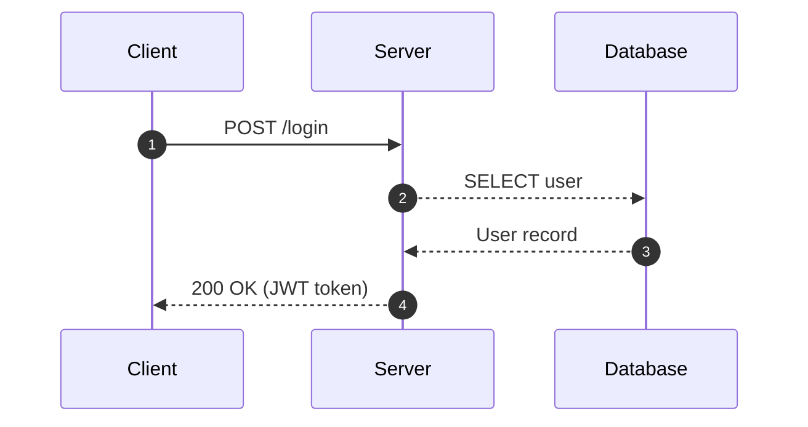
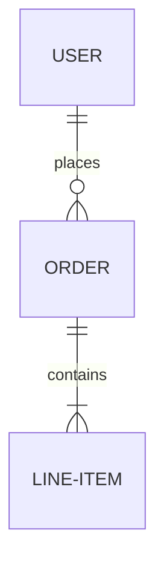

# Mermaid Syntax Quick Reference

## 1. Flowchart (`graph TD` / `graph LR`)

```mermaid
graph TD
    A[Start] --> B{Is it valid?}
    B -- Yes --> C[Process]
    B -- No --> D[Error]
```

## 2. Sequence Diagram (`sequenceDiagram`)

```mermaid
sequenceDiagram
    autonumber
    Client->>Server: POST /login
    Server-->>Database: SELECT user
    Database-->>Server: User record
    Server-->>Client: 200 OK (JWT token)
```

## 3. Entity Relationship (`erDiagram`)

```mermaid
erDiagram
    USER ||--o{ ORDER : places
    ORDER ||--|{ LINE-ITEM : contains
```
